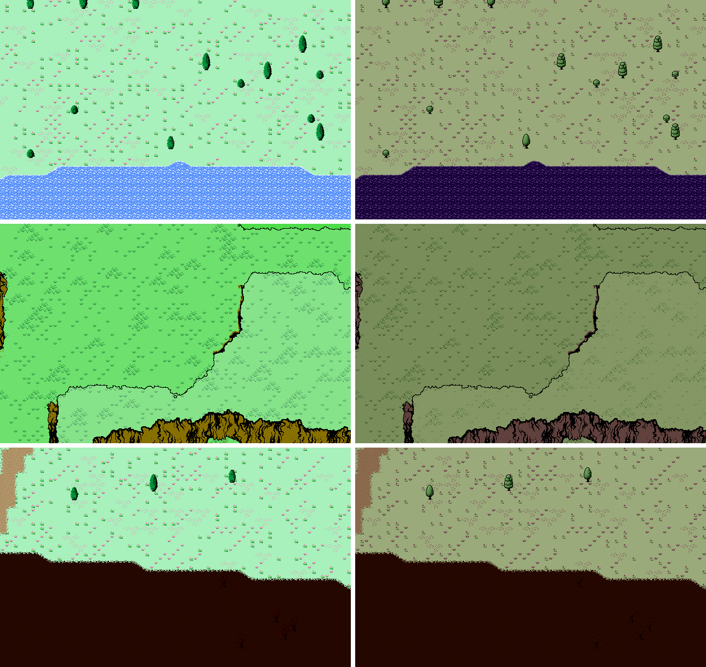

# Art direction: your overworld, in FC World's palette

The game takes its look from **FC World** in *Yume Nikki*, the 8-bit world
inside a 16-bit game. It does not take its shapes. The overworld keeps drawing
what it drew: the curved biome edges, the thin black plateau outlines, the
craggy cliff faces with hand-drawn cracks, and the open fields dotted with
tufts and flower stipple. What changed is the colour, and how much of it a tile
may hold.

Left: the game as it first looked. Right: the same seeds and places, rendered
by the current build (`build_compare.py`).

## Why it reads as 8-bit

Two rules, both taken from FC World's own tileset (`fc_world_reference.png`,
from The Spriters Resource):

1. **One palette.** FC World's 64 colours and nothing else, anywhere on
   screen. That includes art, UI and effects.
2. **Four colours a tile.** FC World never puts more than four colours in one
   16px cell: 289 of its 290 cells hold four or fewer. That is the NES's own
   limit.

Smooth shading is what reads as 16-bit, so no effect blends. A blend makes
colours no palette has. Where the game used to wash or dim with a colour
multiply, it now dithers: a Bayer pattern decides which pixels take a palette
colour, so every pixel is still exactly one of the 64.

| Effect | Was | Now |
|---|---|---|
| Plateau storeys | an alpha wash per storey | a quarter of the pixels per storey in the biome's next ramp colour: 25%, 50%, 75% |
| Cave rock out of view | colour multiply to 30% | 11 of every 16 pixels black |
| Biome fringes on high ground | the neighbour's colour worked through the wash | the neighbour's plain colour |

## Why not FC World's tiles

FC World's own maps are square: grid-aligned stone walls, and boulders on a
regular ground. Your overworld is Mother 1-shaped and organic, and that is its
strength. So the influence is the part of FC World that isn't geometry:

| Take from FC World | Keep from what you have |
|---|---|
| Its 64 colours, four to a tile | Curved biome edges and fringes |
| The violet void where the sea would be | Thin black outlines on plateau rims |
| Warm dark earth, maroon and brown | Craggy cliff faces and their crack drawing |
| One bright accent at a time (a gem, a glint) | Tufts, sprigs and stipple on open ground |
| Uncanny marks in special places (spirals, faces, 1-bit patterns) | The layout of the sheet and every cell id |

## The shift, family by family

`fcremap.REMAP` holds the whole table. The main families:

| Family | Was | Now | Note |
|---|---|---|---|
| Grass | `#4edc4a` | `#6e834f` | Tufts `#325a23` |
| Meadow | `#a8f0bc` | `#9aaa7a` | The lightest field; blossoms `#75264f` |
| Sea | `#5c94fc` + white foam | `#18003b` + `#644880` foam | The void. Its shore rim is the foam |
| Snow | `#fcfcfc` | `#9b94b3` | Pale lavender stone; its scrub `#8c7747` |
| Desert | `#f0e880` | `#8c7747` | Highlights `#b1bf7f`, never yellow |
| Town paths | `#d7a175` | `#b1bf7f` | FC World's floor khaki |
| Cliff rock | `#887000` | `#60413d` | FC's boulder brown; the cracks stay black |
| Wasteland | `#270800` … | unchanged | Already FC World's own ground |
| Player | orange, peach, blue | `#8d6b4f`, `#ffe3ff`, `#4f53a9` | |
| Line | `#000000` | unchanged | Every outline stays black |

Cave rock and trails are families, not loose colours. Each material and each
biome's trail has its own four-stop ramp (`tools/palette_pass.py` `RAMPS`). Its
colours are placed on that ramp by luminance, the same way the generators place
them, so every material keeps its hue and its top stop for the gem. Only the
rarest materials get an accent: kharvite's yellow, veyrite's bright violet,
reality shard's magenta.

Two rules keep the drawing intact:

- **Order is preserved within a family.** A tuft stays darker than its grass, a
  crack darker than its rock.
- **Grounds that meet stay apart.** Grass and meadow, sand and rock, sand and
  trail never share a colour, because the biome edges are drawn in the grounds'
  own colours.

## How it is applied

`tools/palette_pass.py --write` puts the sheet and the player sprite on the
palette, and enforces four colours a tile. **Run it last**, after any
`tools/gen_*.py`, which still paint in their own colours. It is idempotent. It
leaves alone the tint masks, which must stay white, and the generators'
hand-painted masters, which are never drawn and keep their detail for the
generators. It also writes `src/fc_palette_lut.inc` and `fc_palette.gpl` from
`fcremap.py`.

The code's own colours go through the same table. `fc_draw_color()` and
`fc_snap()` (`include/fc_palette.h`) replace `SDL_SetRenderDrawColor`, so a
colour typed into the source (a UI panel, a minimap dot, a fallback tile) lands
where the art's colours land. There is one mapping, generated, not a C++ copy of
it.

To check a frame: `python tools/palette_check.py some.png`. Renders from
`shot.exe` and `dngshot.exe` report 0 pixels off the palette, across towns,
cliffs, coast, snow, wasteland and all seven cave materials with the dim on.

What is not on the palette: the few translucent draws, which are the weapon
swing trails, the door prompt box, and the debug grids. Their colour is on the
palette, but they alpha-blend over the frame. Making them opaque would change
how they read, so that is a separate decision.

## Unused art

`tools/prune_sheet.py` blanked 59 cells nothing draws: the hollow stump, dark
bush and palm, the wasteland's two spotty variants, the stone steps, and the
retired grass, snow and waste ladders. `make sheetcensus` decided what "nothing
draws" means. It compiles the game's own drawing code with every
`SDL_RenderCopy` reporting its source cell, then draws whole worlds, every
dungeon type in every material, and every interior. The prune list is chosen by
hand. The census can veto it but not extend it, because it cannot see art that
is drawn but not wired in yet. The pyramid in the sheet's bottom-right corner is
one such piece, and it stays.

## Painting new art

Open `fc_palette.aseprite` (the palette as swatches, ramp by ramp) or load
`fc_palette.gpl`, and paint with only those colours, four to a tile. Then run
`tools/palette_pass.py` to confirm the tiles pass.

For the uncanny places (dungeon mouths, pyramids, graveyards, the odd landmark),
FC World's motifs are the vocabulary: maroon spirals and faces on black, and
white-on-black 1-bit patterns. They should be rare enough to feel like something
went wrong.

## Trees and buildings

Trees and houses take FC World's drawing, not just its colour. They are built
by `art/structures/build_fc_structures.py`, which stamps them into
`assets/tileset.png` (`--stamp`) and writes `fc_structures.aseprite` with the
old and new art as layers. They obey both rules by construction, so the palette
pass leaves them alone.

- **Trees** are redrawn in FC World's tree language: a hard black outline, three
  sage greens (`#325a23` `#649655` `#82b473`), shadow massed low and right and
  broken with black, sparse highlights high on the left, black trunks. They are
  original drawings, not Yume Nikki's sprites. Snow trees are conifers whose
  caps are the snow ground's colour. The dead tree is unchanged.
- **Houses** keep every line and their exact footprint, so town collision and
  the door cells are untouched. Each is one NES sub-palette, black plus three,
  shared by every tile of it. The stone house has khaki brick `#b1bf7f` with
  wood shingles and side `#8d6b4f` and dark brown `#4e3633`. The white house is
  lavender: `#9b94b3` siding, `#726f8d` slate, `#504b70` shadow, and black glass
  behind bars.

The trees' and houses' art lives in the script: edits go there, and a hand edit
to those cells in the sheet is overwritten by the next stamp. `master.png` is
the original art, frozen. The stamp refuses to run if someone has painted new
art right next to the houses or trees.

## Files

| File | What it is |
|---|---|
| `fc_world_reference.png` | FC World's tileset, the source of the palette |
| `fcremap.py` | The palette and the table of where every old colour goes |
| `fc_palette.gpl`, `fc_palette.aseprite` | The palette for painting |
| `fc_compare.aseprite` / `.png` | Before and after, built through the pixel-plugin |
| `before/` | The original game's three views, frozen |
| `build_compare.py`, `mcpc.py` | Rebuild the comparison: `make shot`, then `python art/direction/build_compare.py` |
| `tools/palette_pass.py` | Puts the art on the palette; writes the game's lookup table |
| `tools/palette_check.py` | Is a rendered frame on the palette? |
| `tools/prune_sheet.py`, `make sheetcensus` | Which cells are drawn; blank the ones chosen to go |
